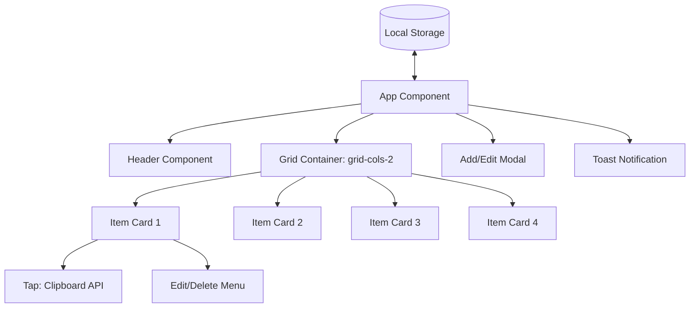

# Implementation Plan: Copier PWA (Mobile-First Grid)

A light, fast Progressive Web App (PWA) built with React, Vite, and Tailwind CSS. Designed specifically for mobile screens to let users save, manage, and instantly copy frequently-used text snippets with a single tap.

---

## 1. System Architecture

The application will operate entirely on the client side, using **React** for state and UI rendering, **Tailwind CSS** for layout and style, and **localStorage** for data persistence. Offline support is provided by `@vite-pwa/plugin`.



---

## 2. Component Design & Layout

### Grid Layout (Mobile-First)
- **Structure**: A fixed 2-column layout (`grid grid-cols-2 gap-4 p-4`) designed for thumb-reach ergonomics on mobile.
- **Card Dimension**: Equal-sized rectangular cards with minimum height to prevent visual clipping.
- **Interaction Model**:
  - **Single Tap on Card Body**: Copies the description to clipboard immediately, plays a quick subtle haptic-like visual animation (scale flash), and triggers a brief checkmark and toast notification ("Copied!").
  - **Edit/Delete Actions**: Accessible via a gear icon or small buttons on the card, or by entering a dedicated "Manage Mode" to prevent accidental editing/deleting when trying to quickly copy. *Decision: A "Manage Mode" toggle in the header is safest for fast-copy workflows.*

### Key Components

1. **`App.jsx`**:
   - Manages state for `items` (initialized with 4 placeholder items if `localStorage` is empty).
   - Manages global UI states: `isManageMode`, `activeModal` (add or edit), `toast`.
   - Syncs state changes with `localStorage`.
2. **`Card.jsx`**:
   - Displays the `title` and `description`.
   - Includes high-contrast text and copy-focused design.
   - Shows action buttons (Edit/Delete) only when `isManageMode` is true.
3. **`Modal.jsx`**:
   - Accessible modal for adding and editing cards.
   - Clean forms with auto-focus on the title.
4. **`Toast.jsx`**:
   - A transient popup at the bottom center of the screen confirming successful copying.

---

## 3. PWA Specification

The application will use `vite-plugin-pwa` to register a Service Worker using the `generateSW` strategy.

### Manifest Configuration (`manifest.webmanifest` / `vite.config.js`):
- **Short Name**: Copier
- **Name**: Copier - Fast Snippet Copy
- **Theme Color**: `#3b82f6` (Tailwind blue-500)
- **Background Color**: `#f3f4f6` (Tailwind gray-100)
- **Display**: `standalone` (removes mobile browser bar for app-like experience)
- **Orientation**: `portrait-primary`
- **Icons**: Simple, high-contrast SVG and multi-size PNG icons (512x512, 192x192) for installability.

---

## 4. Work Steps & Verification Plan

### Phase 1: Environment Setup
- Initialize Vite project using `@vitejs/plugin-react`.
- Configure PostCSS and Tailwind CSS.
- Configure `vite.config.js` with `vite-plugin-pwa`.
- Set up boilerplate structure in `src/`.

### Phase 2: Core State & Persistence
- Define JSON structure for a copy item:
  ```json
  {
    "id": "string-uuid",
    "title": "string",
    "description": "string"
  }
  ```
- Implement React state with `localStorage` persistence.
- Initialize with 4 default mock items representing common copy utilities (e.g., Email, Phone Number, Home Address, Bank Details) to demonstrate the 2x2 grid.

### Phase 3: Mobile UI Implementation
- Style layout using Tailwind's viewport height-based screens (`min-h-screen`, `flex flex-col`).
- Build cards with nice active states (`active:scale-95 transition-transform duration-75`) for a satisfying mobile tactile response.
- Build the clipboard copy mechanic using `navigator.clipboard.writeText`. Provide fallback for older WebViews if necessary.

### Phase 4: Management Features
- Implement a header toggle: **"Copy Mode" vs "Edit Mode"**.
- Create dialog form for adding and editing cards.
- Add quick delete capability.

### Phase 5: PWA Activation & Offline Support
- Build the app and verify the service worker registers.
- Inspect cache behaviors in browser tools to ensure offline availability.
